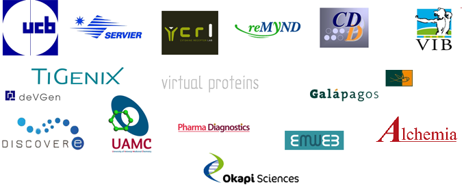

.. _about:

About Silicos-it
================

**Silicos-it** is contributing its expertise to the chemoinformatics community by 
porting as much as possible of source code into the open source domain. Examples 
include our `spectrophore <http://openbabel.org/wiki/Main_Page>`_ descriptors, our 
filtering program :ref:`filter-it <1.0.2/filter-it>` and our pharmacophore tool 
:ref:`align-it <1.0.4/align-it>`.

.. _about_focus:

Focus
-----

**Silicos-it** has been recognized as a preferred commercial partner providing
services within the field of chemoinformatics and molecular modeling. If you 
have a specific problem for which you seek a solution in one of those scientific domains, 
changes are very likely that we can help you. **Silicos-it** has experience in many of 
these areas, including hit identification using protein docking applications, similarity- 
and pharmacophore-based searches, compound clustering, and structure-activity relationships. 
In addition, we can also help you in setting up specialised in-house chemistry-aware 
IT-solutions, such as chemical web-based datastorage platforms build on top 
of open source back-end information technologies.

.. _about_history:

History
-------

The company was founded in 2005 by Hans De Winter, Wilfried Langenaeker and Gert Thijs. At 
that time the company was simply called Silicos. In 2011, a shift in focus was introduced, hereby 
moving away from services using closed source software into the direction of services using - to 
a large extent - open source chemoinformatics tools. To emphasize this complete refocus, 
the name Silicos was changed into **Silicos-it**.

Since 2011, **Silicos-it** has been managed by Hans De Winter. Hans' :download:`curriculum 
<cv_hansdewinter.pdf>` includes more than nine years of industrial expertise as a computational 
chemist at Johnson & Johnson, academic expertise from the Victorian College of Pharmacy in 
Melbourne (Australia) and the Rega-institute at the University of Leuven in Belgium, and was 
co-founder and chief scientific officier of Silicos. Apart from these duties, Hans is also a keen 
`photographer <http://www.blurb.com/user/store/hansdewinter>`_, tries to play tennis and likes 
going downhill on his skies.

.. _about_contact:

Contact
-------

| **Silicos-it**, a division of Imacosi BVBA
| De Roskam 35,
| 2970 Schilde
| Belgium
| mobile +32 472 368 875
| `hans@silicos-it.com <mailto:hans@silicos-it.com>`_

.. _about_customers:

Customers
---------

.. raw:: html

   

.. raw:: html

   

.. _about_citations:

Citations
---------

The open source tools of **Silicos-it** have been cited in other scientific publications:

Sanders, M.P.A.; Barbosa, A.J.M.; Zarzycka, B.; Nicolaes, G.A.F.; Klomp, J.P.G.; de Vlieg, J. & Del Rio, A.
(2012) 
'Comparative analysis of pharmacophore screening tools',
*J. Chem. Inf. Model.*, **52**, 1607-1620.
[`pubmed/22646988 <http://www.ncbi.nlm.nih.gov/pubmed/22646988>`_]

Taylor, R.; Cole, J.C.; Cosgrove, D.A.; Gardiner, E.J.; Gillet, V.J. & Korb, O.
(2012)
'Development and validation of an improved algorithm for overlaying flexible molecules',
*J. Comput. Aided Mol. Des.*, **26**, 451-472
[`pubmed/22538643 <http://www.ncbi.nlm.nih.gov/pubmed/22538643>`_]

Chan, S.L. & Labute, P.
(2010)
'Training a scoring function for the alignment of small molecules',
*J. Chem. Inf. Model.*, **50**, 1724-1735
[`pubmed/20831240 <http://www.ncbi.nlm.nih.gov/pubmed/20831240>`_]

Hutchison, G.R.; Morley, C.; James, C.; Swain, C.; De Winter, H.; Vandermeersch, T. & O'Boyle, N.M. (Ed.)
(2011)
'Open Babel, or how I learned to love the chemistry file format'
[`pdf <http://openbabel.org/docs/current/OpenBabel.pdf>`_]

