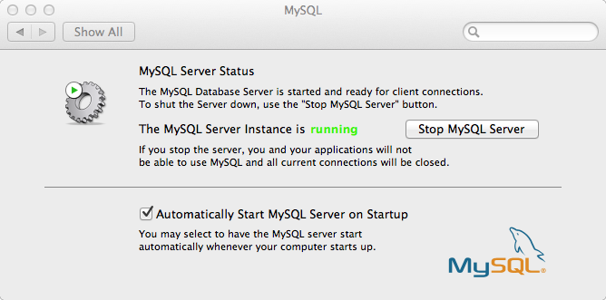
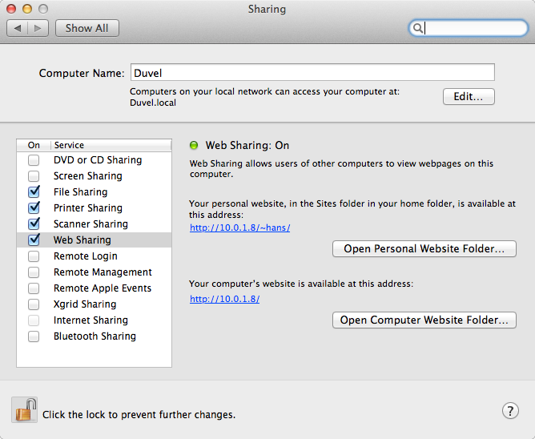
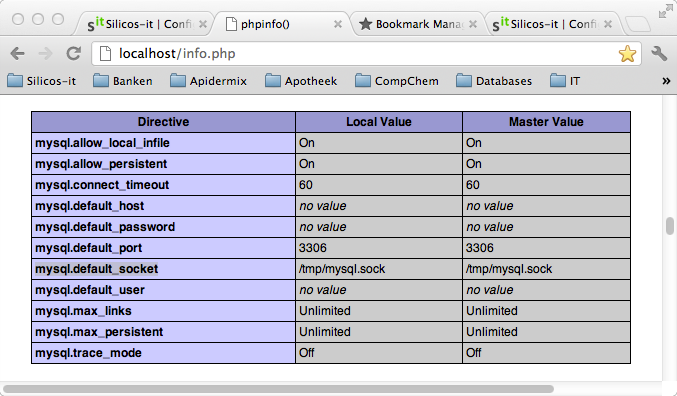

.. _configuring_osx_for_chemoinformatics:

#####################################
Configuring OS X for chemoinformatics
#####################################

.. contents:: Table of contents
   :backlinks: none

.. admonition:: Feedback

   Join our `Google groups community 
   <http://groups.google.com/group/silicos-it-chemoinformatics>`_
   to talk about inconsistencies, errors, raise questions or to make suggestions 
   for improvement.

This blog includes instructions on how to build and install **RDKit**, **OpenBabel**,
**MySQL**, **MySQLdb** and **Mychem**, and **PostgreSQL**. In addition,
with **OS X 10.7**, Apple continues to ship **PHP** 5.3 with **PEAR** and **Apache** 
out of the box. This is how to set it up from a clean install of **OS X 10.7** and 
**OS X 10.8**.

The procedure as described here has been tested on a MacBook Pro with four Intel i7 cores,
and **OS X Lion 10.7.3** installed from scratch, and later updated to **OS X 10.8**.

.. _configuring_osx_for_chemoinformatics_creating_the_right_environment:

******************************
Creating the right environment
******************************

.. _configuring_osx_for_chemoinformatics_root_password_and_installation_directory:

Root password and installation directory
****************************************

By default, **OS X** does not enable you a root password, so it is important to fix this first.

You can easily achieve this from the :menuselection:`System Preferences --> Users & Groups`
menu page, select your login name and click the :guilabel:`Login Options` tab
(you might need to unlock first),
then select :guilabel:`Join...` for accessing the **Network Account Server**, followed by
:guilabel:`Open Directory Utility...`. From the :menuselection:`Edit`
menu in the **Finder** menu bar, select :menuselection:`Enable Root User` and
enter your desired password.

.. highlight:: console

Second, if not already existing, create a :file:`/usr/local` directory and 
change ownership in order to avoid having to do a ``sudo`` each time::

	> if [ ! -f /usr/local ] ; then sudo mkdir -p /usr/local ; fi
	> sudo chown `whoami`:`id -g -n` /usr/local

Create a number of subdirectories in :file:`/usr/local`::

	> if [ ! -f /usr/local/include ] ; then mkdir -p /usr/local/include ; fi
	> if [ ! -f /usr/local/bin ] ; then mkdir -p /usr/local/bin ; fi
	> if [ ! -f /usr/local/lib ] ; then mkdir -p /usr/local/lib ; fi
	> if [ ! -f /usr/local/Cellar ] ; then mkdir -p /usr/local/Cellar ; fi
	> if [ ! -f /usr/local/man/man1 ] ; then mkdir -p /usr/local/man/man1 ; fi

Update your :envvar:`PATH` environment variable so that it points to this directory::

	> export PATH="$PATH:/usr/local"
	> echo "export PATH=\"\$PATH:/usr/local\"" >> ~/.bash_profile

.. _configuring_osx_for_chemoinformatics_xcode:

XCode
*****

Install **XCode** from the App-store and start it up. Under 
:menuselection:`Xcode --> Preferences --> Downloads`, install the **Command Line Tools** 
(you'll need an Apple Developer account which
you can get free of charge). This will install all required compilers.

.. admonition:: **Command Line Tools** under **OS X 10.8**

   Since **OS X 10.8**, the **Command Line Tools** need to be installed directly from the Apple 
   Developer site - there is no way anymore to install them from **XCode**.

The following compilers and preprocessors should now have been installed on your system::

	/usr/bin/clang
		<- /usr/bin/c++
		<- /usr/bin/clang++	
		<- /usr/bin/cc

	/usr/llvm-gcc-4.2/bin/llvm-g++-4.2
		<- /usr/bin/llvm-g++-4.2	
		<- /usr/bin/g++

	/usr/llvm-gcc-4.2/bin/llvm-gcc-4.2
		<- usr/bin/llvm-gcc-4.2	
		<- /usr/bin/gcc

	/usr/llvm-gcc-4.2/bin/i686-apple-darwin11-llvm-g++-4.2
		<- /usr/bin/i686-apple-darwin11-llvm-g++-4.2

	/usr/llvm-gcc-4.2/bin/i686-apple-darwin11-llvm-gcc-4.2
		<- i686-apple-darwin11-llvm-gcc-4.2

	/usr/bin/cpp

	/usr/llvm-gcc-4.2/bin/llvm-cpp-4.2
		<- /usr/bin/llvm-cpp-4.2
	
	
.. _configuring_osx_for_chemoinformatics_java:

Java
****

Open a terminal window, type ``java`` at the shell-prompt and follow 
installation instructions if required.

.. _configuring_osx_for_chemoinformatics_homebrew:

Homebrew
********

**Homebrew** is an easy and flexible way to install UNIX tools on **OS X**. We need **Homebrew**
to install **RDKit** in a subsequent phase::

	> /usr/bin/ruby -e "$(/usr/bin/curl -fksSL https://raw.github.com/mxcl/homebrew/master/Library/Contributions/install_homebrew.rb)"
	> brew doctor

Follow the suggestions and run ``brew doctor`` to check all is working fine. Very
likely you will have to configure **Xcode** with the correct path::
	
	> sudo xcode-select -switch /Applications/Xcode.app/Contents/Developer
   	> brew update

.. _configuring_osx_for_chemoinformatics_pkg_config:

Pkg-config
**********

**Pkg-config** is a tool that provides a unified interface for querying installed libraries.
It is required by **CMake** when installing **Openbabel**::

	> brew install pkg-config

.. _configuring_osx_for_chemoinformatics_eigen2:

Eigen2
******

**Eigen version 2** is required when using the language bindings in the release. Download 
`Eigen2 <http://eigen.tuxfamily.org>`_ (make sure to select version 2 and not 3). It doesn’t need to 
be compiled or installed. Just unzip it and specify its location when configuring :file:`cmake`
(see below) using :samp:`-DEIGEN2_INCLUDE_DIR={location}`. In the example below,
we define a :envvar:`EIGEN` environment variable to specify the location::

	> cd /usr/local/src
	> mv ~/Downloads/eigen-eigen-b23437e61a07.tar .
	> tar -xvf eigen-eigen-b23437e61a07.tar
	> export EIGEN="/usr/local/src/eigen-eigen-b23437e61a07"

.. _configuring_osx_for_chemoinformatics_toolkits:

********
Toolkits
********

.. _configuring_osx_for_chemoinformatics_rdkit:

RDKit
*****

Use the **Homebrew** formula of Eddie Cao to install **RDKit**::

	> brew tap edc/homebrew-rdkit
	> brew install rdkit
	
Create the required environment variables::

	> export RDBASE="/usr/local/Cellar/rdkit/2012.03.1"
	> echo "export RDBASE=\"/usr/local/Cellar/rdkit/2012.03.1\"" >> ~/.bash_profile
	> export PYTHONPATH="$PYTHONPATH:/usr/local/lib/python2.7/site-packages"
	> echo "export PYTHONPATH=\"\$PYTHONPATH:/usr/local/lib/python2.7/site-packages\"" >> ~/.bash_profile

.. highlight:: python
	
Now test the binding by launching **Python**::

	>>> from rdkit.Chem import AllChem
	>>> from rdkit import Chem
	>>> mol = Chem.MolFromSmiles('c1ccccc1')
	>>> mol
	<rdkit.Chem.rdchem.Mol object at 0x102395210>
	>>> mol.GetNumAtoms()
	6

.. _configuring_osx_for_chemoinformatics_openbabel:

Openbabel
*********

.. highlight:: console	

Start by downloading the source files of `version 2.3.2
<http://sourceforge.net/projects/openbabel/files/openbabel/2.3.2/openbabel-2.3.2.tar.gz/download>`_. 
Assuming that the source files were downloaded in the :file:`~/Downloads` directory,
the following procedure installs it::

	> cd /usr/local/src
	> mv ~/Downloads/openbabel-2.3.2.tar.gz .
	> tar -xvf openbabel-2.3.2.tar.gz
	> cd openbabel-2.3.2
	> mkdir build
	> cd build
	> cmake -DCMAKE_INSTALL_PREFIX=/usr/local/openbabel -DEIGEN2_INCLUDE_DIR=$EIGEN ..
	> make

Test the installation. It should pass all tests with failures::

	> make test

and after everything has completed without errors, install::

	> sudo make install

According the procedure as described above, **Openbabel** 
gets installed in the :file:`/usr/local/openbabel/` directory::

	> ls -A /usr/local/openbabel
	bin/		include/	lib/		share/

It might be useful to create some additional links::

	> cd /usr/local/bin
	> for i in /usr/local/openbabel/bin/*; do ln -s $i; done

and update your :file:`.bash_profile` file with essential environment variables::

	> echo "export BABEL_DATADIR=\"/usr/local/openbabel/share/openbabel/2.3.1\"" >> ~/.bash_profile
	> echo "export BABEL_LIBDIR=\"/usr/local/openbabel/lib/openbabel/2.3.1\"" >> ~/.bash_profile
	> echo "export BABEL_INCLUDEDIR=\"/usr/local/openbabel/include/openbabel-2.0\"" >> ~/.bash_profile
	> echo "export DYLD_LIBRARY_PATH=\"\$DYLD_LIBRARY_PATH:/usr/local/openbabel/lib\"" >> ~/.bash_profile

Start up a new shell and test the installation::

	> which obabel
	/usr/local/bin/obabel
	> obabel -V
	Open Babel 2.3.1 -- Apr 21 2012 -- 00:38:28

.. _configuring_osx_for_chemoinformatics_databases:

*********
Databases
*********

.. _configuring_osx_for_chemoinformatics_postgresql:

PostgreSQL
**********

.. highlight:: console

Download `PostgreSQL 9.1.3 <http://www.postgresql.org/ftp/source/v9.1.3>`_
and untar the file into your :file:`/usr/local/src` directory. Move into the
created :file:`/usr/local/src/postgresql-9.1.3` directory and start the installation::

	> cd /usr/local/src/postgresql-9.1.3
	> mkdir build
	> cd build
	> ../configure
	> make world
	> make check
	> sudo make install-world
	> echo "export PATH=\"\$PATH:/usr/local/pgsql/bin\"" >> ~/.bash_profile
	> echo "export DYLD_LIBRARY_PATH=\"/usr/local/pgsql/lib:\$DYLD_LIBRARY_PATH\"" >> ~/.bash_profile

Now create the database cluster::

	> cd /usr/local/pgsql
	> initdb -D /usr/local/pgsql/data

In order to facilitate startup of the server without having to specify the database cluster,
you can set an environment variable in your :file:`~/.bash_profile` file::

	> echo "export PGDATA=\"/usr/local/pgsql/data\"" >> ~/.bash_profile

You can now start and stop the server from the command line::

	> pg_ctl start -l logfile
	> pg_ctl stop

If you want to start the server automatically each time when you start up your computer, you should
add some items into your :file:`/Library/StartupItems` folder::

	> cd /Library/StartupItems
	> sudo mkdir PostgreSQL
	> cd PostgreSQL
	> sudo touch PostgreSQL
	> sudo chmod +x PostgreSQL
	> sudo touch StartupParamaters.plist

Use your favorite text editor to add the following lines to the :file:`PostgreSQL` file
(with *username* replaced by your own username)::

	> cat PostgreSQL
	#!/bin/sh
	
	sudo -u username /usr/local/pgsql/bin/pg_ctl -D /usr/local/pgsql/data -l /usr/local/pgsql/logfile start

and to the :file:`StartupParameters.plist` file::

	> cat StartupParameters.plist
	<?xml version="1.0" encoding="UTF-8"?>
	<!DOCTYPE plist SYSTEM "file://localhost/System/Library/DTDs/PropertyList.dtd">
	<plist version="0.9">
	<dict>
	       <key>Description</key>
	       <string>PostgreSQL</string>
	       <key>Messages</key>
	       <dict>
	               <key>start</key>
	               <string>Starting PostgreSQL</string>
	               <key>stop</key>
	               <string>Stopping PostgreSQL</string>
	       </dict>
	       <key>OrderPreference</key>
	       <string>None</string>
	       <key>Provides</key>
	       <array>
	               <string>PostgreSQL</string>
	       </array>
	</dict>
	</plist>

.. _configuring_osx_for_chemoinformatics_rdkit_cartridge_for_postgresql:

RDKit cartridge for PostgreSQL
******************************

**RDKit** provides a **PostgreSQL** cartridge. In order this to be installed, you'll have to
download the **RDKit** source code in addition to the :ref:`Homebrew installation 
<configuring_osx_for_chemoinformatics_rdkit>` of Eddie Cao.

Start by downloading the source code of **RDKit** `version 2012.03.1 
<http://sourceforge.net/projects/rdkit/files/rdkit/Q1_2012/>`_ and install it under 
:file:`/usr/local/src`. Start the installation by creating a symbolic ink from the source code 
directory into :file:`/usr/local/Cellar`::

	> cd /usr/local/Cellar/rdkit/2012.03.1
	> ln -s /usr/local/src/RDKit_2012_03_1/Code

Make sure that the following environment variables are defined (I'm not sure that all of 
these are required)::

	> export RDBASE="/usr/local/Cellar/rdkit/2012.03.1"
	> export DYLD_LIBRARY_PATH="$DYLD_LIBRARY_PATH:$RDBASE/lib"
	> export PYTHONPATH="$PYTHONPATH:/usr/local/lib/python2.7/site-packages"

Change directory to :file:`/usr/local/src/RDKit_2012_03_1/Code/PgSQL/rdkit` and remove the 
static linking directive from the :file:`Makefile` by replacing the 3rd line (``STATIC_LINK=1``) 
into ``STATIC_LINK=0``. Then start the installation::

	> make
	> sudo make install

.. highlight:: sql

Now you can install the extension from within ``psql``, assuming that you have launched ``psql`` as superuser::

	=> create extension "rdkit";
	CREATE EXTENSION

	=> show rdkit.tanimoto_threshold;
 	rdkit.tanimoto_threshold 
	--------------------------
 	0.5
	(1 row)

	=> select 'c1ccccc1O'::mol;
    	mol    
	-----------
 	Oc1ccccc1
	(1 row)

.. note::
   
   By adding the ``shared_preload_libraries = 'rdkit'`` line to your 
   :file:`/usr/local/pgsql/data/postgresql.conf` file, configuration 
   variables provided by the cartridge will be available since 
   server startup and you could avoid errors like this::

	=> show rdkit.tanimoto_threshold;
	ERROR:  unrecognized configuration parameter "rdkit.tanimoto_threshold"

.. highlight:: console

.. _configuring_osx_for_chemoinformatics_mysql:

MySQL
*****

`Download <http://dev.mysql.com/downloads/mysql/>`_ the latest 64-bit DMG archive 
(in this example it's the 5.5.24 version; you can skip the registration form). 
Mount the disk image and install the **MySQL** server by following the on-screen instructions. 
The installation script installs the **MySQL** server in :file:`/usr/local`.
Update your :file:`~/.bash_profile` file by adding :file:`/usr/local/mysql/bin` to your path and 
by modifying the :envvar:`DYLD_LIBRARY_PATH`::

	> echo "export PATH=\"\$PATH:/usr/local/mysql/bin\"" >> ~/.bash_profile
	> echo "export DYLD_LIBRARY_PATH=\"/usr/local/mysql/lib:\$DYLD_LIBRARY_PATH\"" >> ~/.bash_profile

The disk image you downloaded also contains a *Startup Package & Preferences Pane* which allows you to 
start/stop **MySQL** server from the Mac's *System Preferences* and automatically start **MySQL** server at 
startup. Install this by double-clicking the :file:`MySQLStartupItem.pkg` and :file:`MySQL.prefPane` 
files. **MySQL** will be added to your *System Preferences*:

Make sure to start up the server and check the installation by launching the **MySQL** client 
and log in as *root* (a password is asked for but simply press 'enter')::

	> mysql -u root -p
	
By default, if you have never set a password for the *root* account, the server does not require
a password at all for connecting as *root*. It is however advisable to install this::

	> mysqladmin -u root password yourpassword
	
(with *yourpassword* as the chosen password).

.. _configuring_osx_for_chemoinformatics_mysqldb:

MySQLdb
*******

.. highlight:: console

It is advisable to install **Python** drivers for **MySQL**. Do this downloading `MySQL-python 1.2.3 
<http://sourceforge.net/projects/mysql-python/files/mysql-python/1.2.3/MySQL-python-1.2.3.tar.gz/download>`_ 
and install::

	> cd ~
	> tar xfz MySQL-python-1.2.3.tar.gz
	> cd MySQL-python-1.2.3
	> python setup.py build
	> sudo python setup.py install

.. admonition:: Where are my ``site-packages`` stored?

   The location of the ``site-packages`` directory depends on the operating system 
   and the location in which **Python** was installed. To find out your system's ``site-packages`` 
   location, execute the following from the command line (note that this should be run 
   from a shell prompt, not a **Python** interactive prompt)::

   	> python -c "from distutils.sysconfig import get_python_lib; print get_python_lib()"

.. highlight:: python

Test the installation by launching **Python** and issue the following commands::

	>>> import MySQLdb as mysql
	>>> db = mysql.connect('localhost', 'root', 'password')
	>>> cur = db.cursor()
	>>> cur.execute("select version()")
	1L
	>>> print cur.fetchone()
	('5.5.24',)

.. highlight:: console

.. _configuring_osx_for_chemoinformatics_mychem:

Mychem cartridge for Openbabel
******************************

**Mychem** is a nice chemoinformatics extension for **MySQL** and **OpenBabel**. 
The tool has been developed by Jerome Pansanel
and provides a set of functions to manipulate chemical data that are stored 
within a **MySQL** database. These functions permit you to search, 
analyze and convert chemical data. More information is available on the `Mychem 
website <http://mychem.sourceforge.net/>`_.

Download `Mychem 0.9.1 <http://sourceforge.net/projects/mychem/files/mychem/0.9.1/mychem-0.9.1.tgz/download>`_
and untar the file into your :file:`/usr/local/src` directory. Start the **Mychem** installation by 
creating a ``build`` directory and call ``cmake``::

	> cd /usr/local/src
	> tar -xvf ~/Downloads/mychem-0.9.1.tgz
	> cd /usr/local/src/mychem-0.9.1
	> mkdir build
	> cd build
	> cmake ..
	> make
	> make install

The installation copies the shared library into your :file:`/usr/local/lib` directory and creates
symbolic links::

	> ls -1 /usr/local/lib/libmychem*
	/usr/local/lib/libmychem.0.9.1.dylib*
	/usr/local/lib/libmychem.0.dylib@
	/usr/local/lib/libmychem.dylib@
	
You should now be able to install the ``SQL`` functions::

	> cd /usr/local/src/mychem-0.9.1
	> mysql -u root -p < src/mychemdb.sql

Inspect the feedback well. A typical error could be about not finding the shared library::

	> mysql -u root -p < src/mychemdb.sql 
	Enter password: 
	ERROR 1126 (HY000) at line 10: Can't open shared library 'libmychem.so' (errno: 2 dlopen(/usr/local/mysql/lib/plugin/libmychem.so, 2): image not found)
	
You can fix this error by creating a symbolic link to the correct directory::

	> cd /usr/local/mysql/lib/plugin
	> sudo ln -s /usr/local/lib/libmychem.dylib libmychem.so

This should at least fix the :file:`libmychem.so` location error, but changes are realistic 
that a second type of error will occur::

	> mysql -u root -p < src/mychemdb.sql 
	Enter password: 
	ERROR 1126 (HY000) at line 10: Can't open shared library 'libmychem.so' (errno: 2 dlopen(/usr/local/mysql/lib/plugin/libmychem.so, 2): Library not loaded: libmysqlclient.18.dylib
	  Referenced from: /usr/local/m)
	
Fix this by modifying the :file:`libmychem.so` shared library so that all dependent 
libraries contain the correct path information::

	> otool -L libmychem.so 
	libmychem.so:
		/usr/local/lib/libmychem.0.dylib (compatibility version 0.0.0, current version 0.9.1)
		/usr/local/lib/libopenbabel.4.dylib (compatibility version 4.0.0, current version 4.0.1)
		libmysqlclient.18.dylib (compatibility version 18.0.0, current version 18.0.0)
		/usr/lib/libSystem.B.dylib (compatibility version 1.0.0, current version 159.1.0)
		/usr/lib/libstdc++.6.dylib (compatibility version 7.0.0, current version 52.0.0)
	> sudo find / -name 'libmysqlclient.18.dylib' -print
	Password:
	/usr/local/mysql-5.5.24-osx10.6-x86_64/lib/libmysqlclient.18.dylib
	> sudo install_name_tool -change libmysqlclient.18.dylib /usr/local/mysql-5.5.24-osx10.6-x86_64/lib/libmysqlclient.18.dylib libmychem.so
	> cd /usr/local/src/mychem-0.9.1
	> mysql -u root -p < src/mychemdb.sql 

.. highlight:: mysql

Test the installation by launching **MySQL** and running::

	mysql> SELECT EXACTMASS(SMILES_TO_MOLECULE('c1ccccc1'));
	+-------------------------------------------+
	| EXACTMASS(SMILES_TO_MOLECULE('c1ccccc1')) |
	+-------------------------------------------+
	|                                 78.046950 |
	+-------------------------------------------+
	1 row in set (0.02 sec)

	mysql> SELECT MOLLOGP(SMILES_TO_MOLECULE('c1ccccc1'));
	+-----------------------------------------+
	| MOLLOGP(SMILES_TO_MOLECULE('c1ccccc1')) |
	+-----------------------------------------+
	|                      1.6865999999999999 |
	+-----------------------------------------+
	1 row in set (0.02 sec)

	mysql> SELECT MATCH_SUBSTRUCT('C=O', MOLECULE_TO_SERIALIZEDOBMOL(SMILES_TO_MOLECULE('c1ccccc1C(=O)N')));
	+-------------------------------------------------------------------------------------------+
	| MATCH_SUBSTRUCT('C=O', MOLECULE_TO_SERIALIZEDOBMOL(SMILES_TO_MOLECULE('c1ccccc1C(=O)N'))) |
	+-------------------------------------------------------------------------------------------+
	|                                                                                         1 |
	+-------------------------------------------------------------------------------------------+
	1 row in set (0.00 sec)

.. _configuring_osx_for_chemoinformatics_webservices:

***********
Webservices
***********

.. _configuring_osx_for_chemoinformatics_php:

PHP
***

Create a :file:`/etc/php.ini` file so that the :file:`mysql.sock` file can be found by **PHP**:: 

	> cd /etc
	> sudo cp php.ini.default php.ini
	> sudo chmod u+w php.ini

Use a text editor program to edit the :file:`php.ini` file and replace all instances of 
``/var/mysql/mysql.sock`` into ``/tmp/mysql.sock``, since the latter is the actual 
location of this file on **OS X 10.7** and **OS X 10.8**. Also, make sure to set the 
error reporting level to ``error_reporting = E_ALL | E_STRICT``. Finally, after saving, 
reset the :file:`php.ini` write permissions back to the original ones::

	> sudo chmod u-w php.ini

.. _configuring_osx_for_chemoinformatics_apache:

Apache
******

.. highlight:: console

Give write permission to the :file:`httpd.conf`::

	> cd /etc/apache2
	> sudo chmod u+w httpd.conf

Now edit this :file:`httpd.conf` file using your favorite editor:

* Find ``#LoadModule php5_module libexec/apache2/libphp5.so`` and 
  remove the leading ``#``.
* Find ``AllowOverride None`` within the ``<Directory "/Library/WebServer/Documents">``
  section and change to ``AllowOverride All`` so that :file:`.htaccess` files will work.

In order to specify that files ending with :file:`.htm` or :file:`.html` are also interpreted
as potentially containing **PHP** code, one should tweak the setup a little further.
On **OS X 10.7**, one should look for the entry containing ``<IfModule php5_module>`` 
in the :file:`/etc/apache/httpd.conf` and modify the ``AddType application/x-httpd-php .php`` 
line into ``AddType application/x-httpd-php .php .html .htm``. 
On **OS X 10.8** however, the **PHP** settings are stored in the
:file:`/private/etc/apache2/other/php5.conf` file rather than in :file:`/etc/apache/httpd.conf`.
Modify this :file:`/private/etc/apache2/other/php5.conf` file by changing the 
``AddType application/x-httpd-php .php`` line into ``AddType application/x-httpd-php .php .html .htm``::

	> sudo chmod u+w /private/etc/apache2/other/php5.conf
	> sudo vi /private/etc/apache2/other/php5.conf
	> sudo chmod u-w /private/etc/apache2/other/php5.conf

Change the permissions of :file:`/etc/apache/httpd.conf` back to the original state::

	> sudo chmod u-w httpd.conf

The **Apache** server now needs to be (re)started. The procedure for this is different
between **OS X 10.7** and **OS X 10.8**. Under **OS X 10.7**, one should start **Apache** by 
ticking the :guilabel:`Web Sharing` checkbox in :menuselection:`System Preferences --> Sharing`:

However, in the case of **OS X 10.8**, the **Apache** server needs to be enabled via the 
command line. To start it, type::

	> sudo apachectl start

and to stop it::

	> sudo apachectl stop
	
As an alternative to stooping and then starting again, one can restart using a single
command::

	> sudo apachectl restart
	
After starting **Apache**, test to see if the webserver is working in the browser
by navigating to `localhost <http://localhost>`_. You should see the "It Works!" text.

Under both **OS X 10.7** and **OS X 10.8**, one can test the webserver by creating a 
:file:`info.php` file in the :file:`/Library/Webserver/Documents` directory with 
``<?php phpinfo(); ?>`` written into it::

	> cd /Library/Webserver/Documents
	> sudo vi info.php

Use Safari to navigate to `localhost/info.php <http://localhost/info.php>`_ and check that the 
**PHP** version is displayed (5.3.10 in our case for **OS X 10.7** and 5.3.15 for **OS X 10.8**). 
Also verify that ``mysql.default_socket``, which can be found under the **mysql** heading of 
the output, is pointing to :file:`/tmp/mysql.sock`:

.. _configuring_osx_for_chemoinformatics_pear:

PEAR
****

For some reason, **PEAR** is not set up ready to on **OS X 10.7** and **OS X 10.8**, but the 
install :file:`phar` file is here, so we just need to run it::

	> cd /usr/lib/php
	> sudo php install-pear-nozlib.phar
	> cd /etc
	> sudo chmod u+w php.ini

Edit :file:`php.ini` with your editor and find the line ``;include_path = ".:/php/includes"``.
Change it into ``include_path = ".:/usr/lib/php/pear"`` (make sure to remove the leading ``;``).
Reset the :file:`php.ini` write permissions and update the **PEAR** settings::

	> sudo chmod u-w php.ini
	> cd /usr/lib/php
	> sudo pear channel-update pear.php.net
	> sudo pecl channel-update pecl.php.net
	> sudo pear upgrade-all
	> sudo pear install Mail

