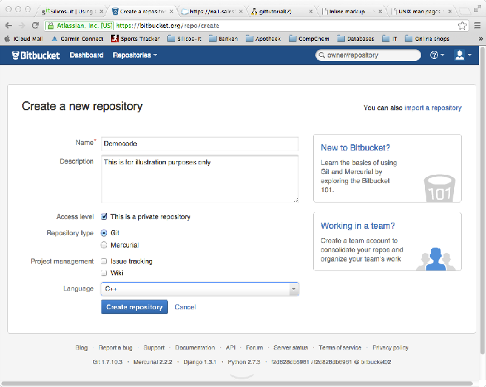
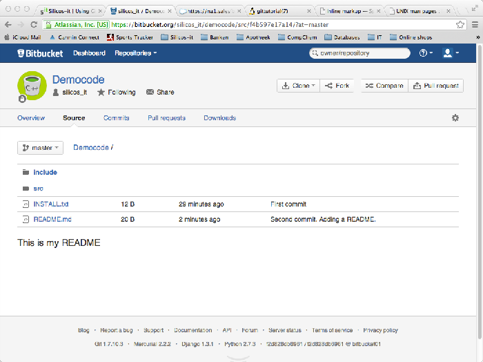

.. _using_git_and_bitbucket:

.. highlight:: console

===========================================
Using Git and Bitbucket for version control
===========================================

In this cookbook section, we want to describe how we combine the
`Git <http://git-scm.com/>_` version control system with the 
`Bitbucket <https://bitbucket.org/>`_ remote repository
as our preferred tool to keep our code and webfiles syncronised across different 
**OS X** computer systems. `Bitbucket <https://bitbucket.org/>`_ is a repository 
site that is free of charge for up to 5 users and unlimited private repositories. 
It supports both `Git <http://git-scm.com/>`_ and `Mercurial <http://mercurial.selenic.com/>`_
as version control systems, but we will only focus on **Git** on this cookpage.
We will demonstrate the setup using a fake demo code that is called **democode**.

Please join our `Google groups community 
<http://groups.google.com/group/silicos-it-chemoinformatics>`_
to talk about inconsistencies, errors, raise questions or to make suggestions 
for improvement.

.. _using_git_and_bitbucket_git_on_os_x_107_and_108:

Git on OS X
===========

**Git** is included in **XCode** tools of **OS X 10.8**. Please follow the 
:ref:`instructions <configuring_osx_for_chemoinformatics_xcode>` in our cookbook on how 
to install **XCode**, if desired.

Make sure that **Git** is installed and working correctly::

	> which git
	/usr/bin/git
	> git --version
	git version 1.7.9.6 (Apple Git-31.1)
	> git --help
	usage: git [--version] [--exec-path[=<path>]] [--html-path] [--man-path] [--info-path]
	           [-p|--paginate|--no-pager] [--no-replace-objects] [--bare]
	           [--git-dir=<path>] [--work-tree=<path>] [--namespace=<name>]
	           [-c name=value] [--help]
	           <command> [<args>]

	The most commonly used git commands are:
	   add        Add file contents to the index
	   bisect     Find by binary search the change that introduced a bug
	   branch     List, create, or delete branches
	   checkout   Checkout a branch or paths to the working tree
	   clone      Clone a repository into a new directory
	   commit     Record changes to the repository
	   diff       Show changes between commits, commit and working tree, etc
	   fetch      Download objects and refs from another repository
	   grep       Print lines matching a pattern
	   init       Create an empty git repository or reinitialize an existing one
	   log        Show commit logs
	   merge      Join two or more development histories together
	   mv         Move or rename a file, a directory, or a symlink
	   pull       Fetch from and merge with another repository or a local branch
	   push       Update remote refs along with associated objects
	   rebase     Forward-port local commits to the updated upstream head
	   reset      Reset current HEAD to the specified state
	   rm         Remove files from the working tree and from the index
	   show       Show various types of objects
	   status     Show the working tree status
	   tag        Create, list, delete or verify a tag object signed with GPG

	See 'git help <command>' for more information on a specific command.

.. _using_git_and_bitbucket_taking_your_project_under_git_control:

Taking your project under Git
=============================

.. _using_git_and_bitbucket_local_filesystem:

Local filesystem
----------------

The first thing to do is to create all necessary files of your project and install
them locally on your filesystem. In the case of our demo code, the files are stored locally
under a :file:`Repo/Code` directory structure::

	> cd /Users/hans/Repo/Code/democode
	> ls -l -R
	total 8
	INSTALL.txt
	include/
	src/

	./include:
	total 16
	include1.h
	include2.h

	./src:
	total 16
	source1.cpp
	source2.cpp

The :file:`/Users/hans/Repo/Code/democode` contains the two directories :file:`include/` 
and :file:`src/` and a single :file:`INSTALL.txt` file. The :file:`include/` directory 
contains the :file:`include1.h` and :file:`include2.h` files, while the :file:`src/` 
directory contains the :file:`source1.cpp` and :file:`source2.cpp` files.

.. _using_git_and_bitbucket_git_configuration_and_importing_new_project:

Git configuration and importing a new project
---------------------------------------------

It is a good idea to introduce yourself to **Git** with your name and public email address 
before doing any operation. The easiest way to do so is::

	> git config --global user.name "My name"
	> git config --global user.email xxx@yyyy.xx

This creates a :file:`.gitconfig` file in your home directory::

	> cat ~/.gitconfig
	[user]
		name = My name
		email = xxx@yyyy.xx

Importing our **democode** project is straigthforward::

	> git init
	Initialized empty Git repository in /Users/hans/Repo/Code/democode/.git/
	
You’ve now initialized the working directory. You may notice a new directory created,
named :file:`.git`::

	> ls -l
	.git/
	INSTALL.txt
	include/
	src/
	
Next, tell **Git** to take a snapshot of the contents of all files under the current 
directory (note the :file:`.`) with :command:`git add`::

	> git add .

This snapshot is now stored in a temporary staging area which **Git** calls the `index`. 
You can permanently store the contents of the index in the repository with :command:`git commit`::

	> git commit -m 'First commit'
	[master (root-commit) be698c0] First commit
	 5 files changed, 5 insertions(+)
	 create mode 100644 INSTALL.txt
	 create mode 100644 include/include1.h
	 create mode 100644 include/include2.h
	 create mode 100644 src/source1.cpp
	 create mode 100644 src/source2.cpp
	

.. _using_git_and_bitbucket_creating_a_bitbucket_repository:

Creating a Bitbucket repository
===============================

Before being able to create a free repository at `Bitbucket <https://bitbucket.org/>`_,
one should register and create an account. Go to the `Bitbucket <https://bitbucket.org/>`_ website
and follow the instructions.

Once registered, you can create a new remote repository by following the online instructions
from **Bitbucket**. Fill in the required fields (make sure to select the :guilabel:`Git` checkbox
as :guilabel:`Repository type` and submit the :guilabel:`Create repository` button:

This will bring you to a new screen from which you can specify to import the code
from your local repository. Follow these instruction by typing in a console on your
local system::

	> cd /Users/hans/Repo/Code/democode
	> git remote add origin ssh://git@bitbucket.org/silicos_it/democode.git

This command adds a remote called `origin` for the remote repository at 
`ssh://git@bitbucket.org/silicos_it/democode.git`. This is the url that was provided by
the **Bitbucket** online instructions. This information is stored in the :file:`.git/`
directory::

	> cd /Users/hans/Repo/Code/democode/.git
	> cat config
	[remote "origin"]
	        url = ssh://git@bitbucket.org/silicos_it/democode.git
	        fetch = +refs/heads/*:refs/remotes/origin/*
	[branch "master"]
	        remote = origin
	        merge = refs/heads/master

The next thing to do now is to push the contents of your local repository into the 
**Bitbucket** remote repository (called the `origin`)::

	> git push -u origin --all
	Counting objects: 9, done.
	Delta compression using up to 8 threads.
	Compressing objects: 100% (4/4), done.
	Writing objects: 100% (9/9), 513 bytes, done.
	Total 9 (delta 0), reused 0 (delta 0)
	remote: bb/acl: silicos_it is allowed. accepted payload.
	To ssh://git@bitbucket.org/silicos_it/democode.git
	 * [new branch]      master -> master
	Branch master set up to track remote branch master from origin.

The :option:`--all` option specifies that all references in the index will be pushed instead of
naming each file separately.

.. _using_git_and_bitbucket_adding_readme_file:

Adding a README file
--------------------

Every **Bitbucket** project needs a :file:`README` file. This :file:`README` will appear on your
**Bitbucket** homepage and explain what your project is all about::

	> cd /Users/hans/Repo/Code/democode
	> echo "# This is my README" >> README.md
	> git add README.md
	> git commit -m "Second commit. Adding a README."
	[master f4b597e] Second commit. Adding a README.
	 1 file changed, 1 insertion(+)
	 create mode 100644 README.md
	> git push -u origin master
	Counting objects: 4, done.
	Delta compression using up to 8 threads.
	Compressing objects: 100% (2/2), done.
	Writing objects: 100% (3/3), 385 bytes, done.
	Total 3 (delta 0), reused 0 (delta 0)
	remote: bb/acl: silicos_it is allowed. accepted payload.
	To ssh://git@bitbucket.org/silicos_it/democode.git
	   be698c0..f4b597e  master -> master
	Branch master set up to track remote branch master from origin.

You can inspect the **Bitbucket** remote repository from the web-interface:

Working with branches
=====================

.. _using_git_and_bitbucket_creating_new_branches:

Creating new branches
---------------------

.. note::

	A nice tutorial on branching in **Git** can be found at the 
	`Git-scm <http://git-scm.com/book/en/Git-Branching-Basic-Branching-and-Merging>`_ site.

The `master` branch is the default branch that is created automatically for you. One
can inspect all branches by typing::

	> git branch
	* master

A single **Git** repository can maintain multiple branches of development. To create 
a new branch named `experimental`, use::

	> git branch experimental
	> git branch
	  experimental
	* master

The `experimental` branch is the one you just created, and the `master` branch is a default 
branch that was created for you automatically. The asterisk marks the branch you are currently on.
Use the ::option::`checkout` option to switch to another branch::

	> git checkout experimental
	Switched to branch 'experimental'

.. note::
	
	A shortcut for::
	
	> git branch experimental
	> git checkout experimental
	
	is::
	
	> git checkout -b experimental

.. _using_git_and_bitbucket_adding_removing_files_directories:

Adding and removing files/directories
-------------------------------------

With the `experimental` branch now being the active local branch, one can experiment with adding,
editing or removing files without affecting the `master` branch. Add a new file::

	> echo "new file" > new_file.txt
	> git status
	# On branch experimental
	# Untracked files:
	#   (use "git add <file>..." to include in what will be committed)
	#
	#	new_file.txt
	nothing added to commit but untracked files present (use "git add" to track)
	
The :command:`git status` command shows you the differences between what has been committed
and what is actually on your filesystem. In the preceding example, the output of the command
shows that the :file:`new_file.txt` has been added to the filesystem but not yet brought
under **Git** control. You can correct this by::

	> git add .
	> git status
	# On branch experimental
	# Changes to be committed:
	#   (use "git reset HEAD <file>..." to unstage)
	#
	#	new file:   new_file.txt
	#
	> git commit -m "Adding new_file.txt"
	[experimental 3710207] Adding new_file.txt
	 1 file changed, 1 insertion(+)
	 create mode 100644 new_file.txt
	> git status
	# On branch experimental
	nothing to commit (working directory clean)

Next, remove the :file:`include` directory from the local repository and the local filesystem::

	> git rm -r include/
	> git status
	# On branch experimental
	# Changes to be committed:
	#   (use "git reset HEAD <file>..." to unstage)
	#
	#	deleted:    include/include1.h
	#	deleted:    include/include2.h
	#
	> ls -l
	.git/
	INSTALL.txt
	README.md
	new_file.txt
	src/

and commit the changes::

	> git commit -a -m "deleted include directory"

followed by pushing all changes to the **Bitbucket** remote repo::

	> git push -u origin experimental
	Counting objects: 3, done.
	Delta compression using up to 8 threads.
	Compressing objects: 100% (2/2), done.
	Writing objects: 100% (2/2), 241 bytes, done.
	Total 2 (delta 1), reused 0 (delta 0)
	remote: bb/acl: silicos_it is allowed. accepted payload.
	To ssh://git@bitbucket.org/silicos_it/democode.git
	   3710207..59306f2  experimental -> experimental
	Branch experimental set up to track remote branch experimental from origin.

This creates a copy of the `experimental` branch on the **Bitbucket** remote repo.

.. note::

	If one only want to remove a file from the repository without deleting
	the file physically from the filesystem, one should use::
	
	> git rm --cached <file>
	
	or for an entire directory::
	
	> git rm --cached <dirname/>

.. _using_git_and_bitbucket_merging_branches:

Merging and deleting branches
-----------------------------

In order to merge the `master` branch with the `experimental` branch, first we move
to the `master` and use the :command:`git merge` command::

	> git checkout master
	Switched to branch 'master'
	> git merge experimental
	Updating f4b597e..59306f2
	Fast-forward
	 include/include1.h |    1 -
	 include/include2.h |    1 -
	 new_file.txt       |    1 +
	 3 files changed, 1 insertion(+), 2 deletions(-)
	 delete mode 100644 include/include1.h
	 delete mode 100644 include/include2.h
	 create mode 100644 new_file.txt

As the feedback mentions, two files have been deleted (:file:`include/include1.h`
and :file:`include/include1.h`) and another file has been added (:file:`new_file.txt`).

Once the two branches have been merged, one can now delete the `experimental` branch::

	> git branch -d experimental
	
or::

	> git branch -D experimental
	
The difference between the :option:`-d` and :option:`-D` options is that the first command
only deletes a branch after the it has been merged; you cannot delete a branch with the
:option:`-d` command that has not been merged yet. Hence, if you really do want to delete a 
branch that has not been merged at the risc to loose work, you can force-delete it with the 
:option:`-D` option::

	> git branch
	* master
	> git push -u origin master
	remote: bb/acl: silicos_it is allowed. accepted payload.
	To ssh://git@bitbucket.org/silicos_it/democode.git
	   f4b597e..59306f2  master -> master
	Branch master set up to track remote branch master from origin.

Although the `experimental` branch has been removed from your local **Git** repository,
the branch is still present on the remote repository at **Gitbucket**. You can delete
this branch from the remote using the rather obscure :command:`git push [remotename] :[branch]`
command::

	> git push origin :experimental
	remote: bb/acl: silicos_it is allowed. accepted payload.
	To ssh://git@bitbucket.org/silicos_it/democode.git
	 - [deleted]         experimental

.. _using_git_and_bitbucket_keeping_repos_synchronised:

Keeping repos synchronised
==========================

The **Git** repository system in combination with a remote repository like **Bitbucket** provides
a nice tool to keep code and files synchronised across different computer systems. With
all files uploaded and synchronised onto the **Bitbucket** remote repo, one can make 
a clone on another computer system. For this purpose, move to the directory where
you want to create the new local repository, and enter the following command 
:command:`git clones git@gitbucket.org:[username]/[projectname].git`. For the
current example this becomes::

	> git clone git@gitbucket.org:silicos_it/democode.git
	Cloning into democode...
	remote: Counting objects: 17, done.
	remote: Compressing objects: 100% (10/10), done.
	remote: Total 17 (delta 3), reused 0 (delta 0)
	Receiving objects: 100% (17/17), done.
	Resolving deltas: 100% (3/3), done.
	
In case of doubt, the actual url one has to provide is shown at the **Bitbucket** website
under your account under the :guilabel:`Clone` button.

After having cloned the remote repository locally, one can keep the local repository
synchronised with the :command:`git pull [repository]` command::

	> git pull origin
	remote: Counting objects: 5, done.
	remote: Compressing objects: 100% (2/2), done.
	remote: Total 3 (delta 0), reused 0 (delta 0)
	Unpacking objects: 100% (3/3), done.
	From bitbucket.org:silicos_it/democode
	   59306f2..123bec7  master     -> origin/master
	Updating 59306f2..123bec7
	Fast-forward
	 INSTALL.txt |    1 +
	 1 files changed, 1 insertions(+), 0 deletions(-)

.. _using_git_and_bitbucket_versioning:

Versioning
==========

We are using the following procedure to introduce versioning in our software development:

1. Create a `version` branch and make this branch the default
2. Introduce the required changes in the source code, such as updating the version number in the Makefiles
3. Commit the changes and push the code back to the remote repository
4. Make the `master` branch again the default
5. Merge the `version` branch with the `master` branch

Applied to the **democode** project, these are the command lines::

	> git checkout -b 1.0.1
	Switched to a new branch '1.0.1'
	> echo "Version 1.0.1" > version.1.0.1.txt
	> git status
	# On branch 1.0.1
	# Untracked files:
	#   (use "git add <file>..." to include in what will be committed)
	#
	#	version.1.0.1.txt
	nothing added to commit but untracked files present (use "git add" to track)
	> git add .
	> git status
	# On branch 1.0.1
	# Changes to be committed:
	#   (use "git reset HEAD <file>..." to unstage)
	#
	#	new file:   version.1.0.1.txt
	#
	> git commit -a -m "Version 1.0.1"
	[1.0.1 a21097c] Version 1.0.1
	 1 files changed, 1 insertions(+), 0 deletions(-)
	 create mode 100644 version.1.0.1.txt
	> git push -u origin 1.0.1
	Counting objects: 4, done.
	Delta compression using up to 4 threads.
	Compressing objects: 100% (2/2), done.
	Writing objects: 100% (3/3), 297 bytes, done.
	Total 3 (delta 1), reused 0 (delta 0)
	remote: bb/acl: silicos_it is allowed. accepted payload.
	To git@bitbucket.org:silicos_it/democode.git
	 * [new branch]      1.0.1 -> 1.0.1
	Branch 1.0.1 set up to track remote branch 1.0.1 from origin.
	> git checkout master
	Switched to branch 'master'
	> git merge 1.0.1
	Updating 123bec7..a21097c
	Fast-forward
	 version.1.0.1.txt |    1 +
	 1 files changed, 1 insertions(+), 0 deletions(-)
	 create mode 100644 version.1.0.1.txt
	> git push -u origin master
	Total 0 (delta 0), reused 0 (delta 0)
	remote: bb/acl: silicos_it is allowed. accepted payload.
	To git@bitbucket.org:silicos_it/democode.git
	   123bec7..a21097c  master -> master
	Branch master set up to track remote branch master from origin.

	
	

