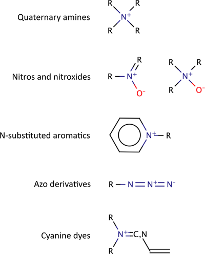

.. _molspace:

**********
|molspace|
**********

|molspace| is the collection of small molecule compounds at **Silicos-it**. 
|molspace| is build on top of a **MySQL**-based storage system in combination with the 
**OpenBabel/Mychem** database cartridge and the **RDKit/Python** toolkit for molecular 
processing. This section describes about how molecules are prepared and stored in the 
|molspace| system. In addition, interesting statistics are presented about the chemical
structures that are stored in |molspace|.

Please join our `Google groups community 
<http://groups.google.com/group/silicos-it-chemoinformatics>`_
to talk about inconsistencies, errors, raise questions or to make suggestions 
for improvement.

.. note::

   The molecules in |molspace| are for internal- and client-use only and cannot be shared 
   due to contractual agreements with the vendors. Please contact the vendors individually 
   if you would like to retrieve the molecules yourselves.

-------------------------
Cleaning up the molecules
-------------------------

In-silico representation of molecules within the context of chemoinformatics has always been
a challenge due to the complex nature of chemical connectivity and how it can be represented
by a computer. In particular, issues with tautomerisation, ionisation and aromaticity 
impose challenging approaches from the chemoinformatics tools and their users in order 
to be able to store, retrieve and manipulate chemical information in a high-throughput fashion.

In this context, the majority of the molecules contained within the collections of chemistry 
vendors need at least one or more particular cleaning steps in order to make them consistent in 
terms of their chemical constitution. Typical variations that have been observed in the 
chemical descriptions of molecules include:

**Distinct representations of identical salt forms**
	For example, the hydrochloride salt is often represented in two different forms, 
	the first one as ``[Cl-]`` and the other one as ``[Cl]``.

**Distinct tautomerisation representations of identical structures**
	In many cases this comes back to the issue of different tautomeric forms, 
	like is the case for the imidazolium structure which can be represented as 
	``[*]c1c[nH+]c[nH]1`` or ``[*]c1c[nH]c[nH+]1``.

**Ionised versus neutral forms of identical structures**
	Many functional groups can be ionised at physiological pH and a uniform
	representation of these functional groups poses some additional issues as a 
	consquence. For example, primary, secundary and tertiary amines are often stored in 
	their ionised (``[NH3+]``, ``[NH2+]``, ``[NH1+]``, 
	respectively) or in the neutral form (``N``). Acidic groups, like carboxylic acids, 
	can also be stored in their ionised
 	(``C(=O)[O-]``) or neutral form (``C(=O)O``). With 
	tetrazole as another example of an acidic group, the situation is even less consistent 
	due to tautomerisation complexities
	(``[*]c1nn[n-]n1`` versus ``[*]c1nnn[n-]1`` versus ``[*]c1nnn[nH]1``).

**Unrecognised oxidation states**
	The majority of the chemoinformatics toolkits have been
	designed to work with standard organic chemical molecules as such. In this respect, less common
	oxidation states are not recognised by the software. For example, **RDKit** only 
	recognises the lowest oxydation state of 
	chlorine (I), and therefore there is no suitable manner to store perchlorate in its correct SMILES 
	representation, unless one falls back to the incorrect ``[Cl+3]([O-])([O-])([O-])[O-]``
	representation. Another issue is ``P`` of which **RDKit** only recognizes
	oxidation state V (like in phosphoric acid H\ :sub:`3`\ PO\ :sub:`4`\ ) but not state III, 
	leading to the incorrect representation of trimethylphosphane as ``C[P+](C)C``
	instead of ``CP(C)C``.
	

It is important that the compounds are 'as-clean-as-possible' before storing
them in the database. Molecules wth inconsistent connectivities, unrecognised atom types,
wrong bond orders, and incompatible oxidation states could lead to significant 
delays in the post-screening analysis of the data results. The subsequent sections 
describe the subsequent cleaning steps that 
are performed on the molecules before these are stored in |molspace|.

Desalting
*********

Before storing in the |molspace| database, each molecule is desalted by separating the largest
fragment of the molecule from the other fragments. The largest fragment is termed the *core*, and
the remaining fargments are termed the *salt*. Within the context of this desalting process, the
*core* is defined as the fragment having the largest number of non-hydrogen atoms. In situations
with two or more largest fragments having an identical number of non-hydrogen atoms, additional 
selection criteria for the selection of the *core* fragment are first the fragment with the 
smallest number of bonds, second the fragment with the smallest molecular weight, and finally the 
fragment with the 'smallest' SMILES string according the string comparison algorithm as 
implemented in **Python**.

The desalting process involves separating each molecule in its fragments (if any),
followed by separating the largest fragment from the others. *Salts* are simply stored in their 
SMILES notation and no further analysis like fingerprinting and charge neutralisation is 
performed on these fragments. The *core* is also stored in its SMILES notation, but additional 
properties are calculated from it for later retrieval.

Removing uncommon elements
**************************

After separating molecules in the **core** and **salt** parts, the next step in the cleaning process
involves removing molecules of which the **core** contains at least one atom that is different than
``H``, ``B``, ``C``, ``N``, ``O``, ``F``, ``Si``, ``P``, ``S``, ``Cl``, ``Br`` or ``I``:

Charge neutralisation
*********************

Since ionizable functions, like carboxylic acids and amines, can be represented either in their
neutral or charged forms, it is important to introduce consistency by converting these groups into
a single representation.

Within |molspace| the option has been taken to convert each molecule into its neutral form. 
Rules have been implemented to convert imidazoles, amines, carboxylic acids, thiols, sulfonamides, 
enamines, tetrazoles and sulfoxides into their neutral charge form. These rules have been 
incorporated using a SMARTS-based reaction scheme.

Removing remaining charges
**************************

In the last cleaning step, molecules carrying unwanted charges are removed. Not all
charges are considered 'unwanted'; the following figure shows some functional
groups that are allowed:

.. _molspace_allowed_charges_figure:

   Figure 1. Structures of charged functional groups that are allowed in |molspace|.

